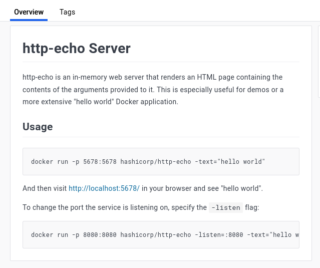
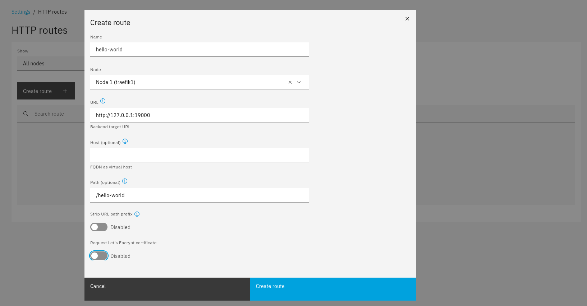
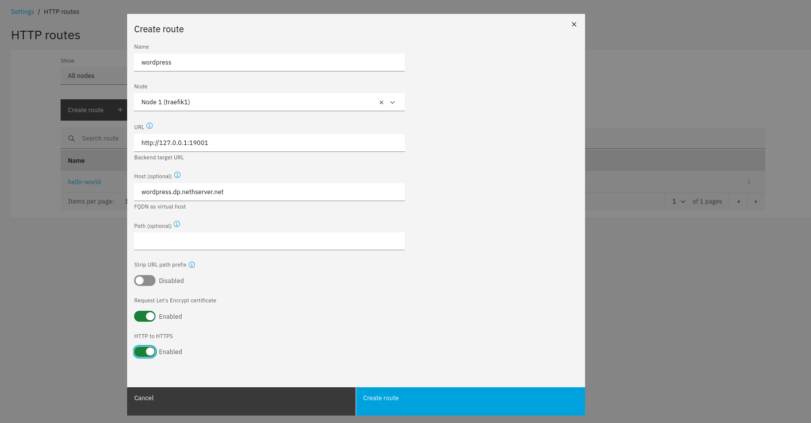
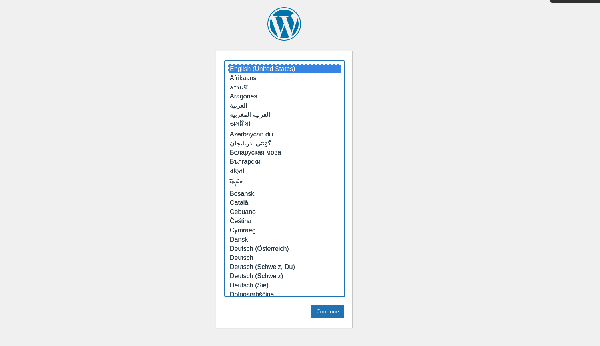
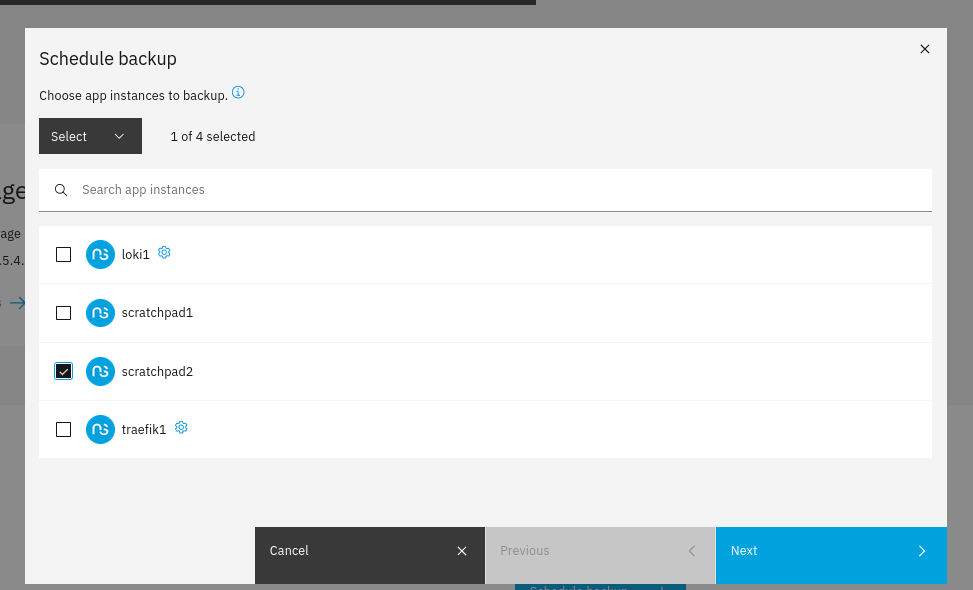

<style>
.reveal h1, .reveal h2, .reveal h3, .reveal h4, .reveal h5 { text-transform: none; }
</style>

# Run any service<br>on NS8

---

<!-- .slide: style="text-align: left;" -->

## Contents

- NS8 terms and architecture
- Explore a node
- Run a simple service
- Run a complex service
- Service backup/restore

---

<!-- .slide: data-transition="slide" -->

<object data="NS8_Glossary_0.svg" type="image/svg+xml"></object>

---

<object data="NS8_Glossary_1.svg" type="image/svg+xml"></object>

---

<object data="NS8_Glossary_2.svg" type="image/svg+xml"></object>

---

<object data="NS8_Glossary_3.svg" type="image/svg+xml"></object>

---

<object data="NS8_Glossary_4.svg" type="image/svg+xml"></object>

---

<object data="NS8_Glossary_5.svg" type="image/svg+xml"></object>

---

<object data="NS8_Glossary_6.svg" type="image/svg+xml"></object>

---

<object data="NS8_Glossary_7.svg" type="image/svg+xml"></object>

---

<object data="NS8_Glossary_8.svg" type="image/svg+xml"></object>

---

<object data="NS8_Glossary_9.svg" type="image/svg+xml"></object>

---

<!-- .slide: data-transition="slide" -->

## Explore a node

---

```text [1,4]
[root@rl1 ~]# loginctl list-users
 UID USER       LINGER STATE    
   0 root       no     active
1001 traefik1   yes    lingering
1002 loki1      yes    lingering
1003 ldapproxy1 yes    lingering

4 users listed.
```

Unix user sessions<br/>
they are module instances (AKA _applications_)


---

`lingering`

started automatically at boot

---

<!-- .slide: style="text-align: left;" -->

## agents

- each module instance has one running agent
- started at boot, when the user session starts
- the agent runs actions and handles events

---


```text [1,3,4]
[root@rl1 ~]# ps -o user,cmd $(pgrep -x agent)
USER     CMD
root     /usr/local/bin/agent --agentid=cluster --actionsdir= --actionsdir=/var/lib/nethserver/cluster/actions --eventsdir=/var/lib/nethserver/cluster/events
root     /usr/local/bin/agent --agentid=node/1 --actionsdir= --actionsdir=/var/lib/nethserver/node/actions --eventsdir=/var/lib/nethserver/node/events
traefik1 /usr/local/bin/agent --agentid=module/traefik1 --actionsdir=/usr/local/agent/actions --actionsdir=/home/traefik1/.config/actions --eventsdir=/home/traefik1/.config/events
ldappro+ /usr/local/bin/agent --agentid=module/ldapproxy1 --actionsdir=/usr/local/agent/actions --actionsdir=/home/ldapproxy1/.config/actions --eventsdir=/home/ldapproxy1/.config/events
loki1    /usr/local/bin/agent --agentid=module/loki1 --actionsdir=/usr/local/agent/actions --actionsdir=/home/loki1/.config/actions --eventsdir=/home/loki1/.config/events
```

A list of `agent` processes in the local node<br>
and the respective Unix user

---

<!-- .slide: style="text-align: left;"> -->

&#11088; Special module-like agent contexts

- cluster
- node
- **rootfull modules** (optional)

...running as root

---

## agent environment

`runagent` runs a command as a module agent does

```text [1]
[root@rl1 ~]# runagent -m traefik1 whoami
traefik1
```

Does it recall `su` and `runuser`?

---

Special current directory 

```text
[root@rl1 ~]# runagent -m traefik1 pwd
/home/traefik1/.config/state
```

to store the module configuration

---

`runagent` in short
- runs command as a different user
- `cd` into the module state directory
- sets some environment variables...


---

...like Redis credentials

```text
[root@rl1 ~]# runagent -m traefik1 env | grep REDIS
REDIS_ADDRESS=cluster-leader:6379
REDIS_REPLICA_ADDRESS=127.0.0.1:6379
REDIS_USER=module/traefik1
REDIS_PASSWORD=4d3a5c36-f9c3-4c4c-b066-c794931d7c86
```

and much more!

---

Explore a node

## Containers

---

```text [1,3]
[root@rl1 ~]# podman ps
CONTAINER ID  IMAGE                             COMMAND               CREATED            STATUS            PORTS       NAMES
99b96193930f  ghcr.io/nethserver/redis:2.2.0    redis-server /dat...  About an hour ago  Up About an hour              redis
449ff0f85f7f  ghcr.io/nethserver/restic:2.2.0   rclone serve webd...  About an hour ago  Up About an hour              rclone-webdav
f5b373c96005  docker.io/grafana/promtail:2.9.2  -config.file=/etc...  About an hour ago  Up About an hour              promtail
```

some **rootfull¹** containers<br/>
keep in mind Redis, on line 3 &#128070;


Note:
1. Rootfull does not necessarily mean running as root: the service might
   drop privileges and switch user
---


Let's look at the (wrong) Traefik instance

```text
[root@rl1 ~]# runagent -m traefik2 podman ps
[FATAL] Cannot find module traefik2 in the local node
```

OUCH! Bad module ID. List of valid module names?

```text [1,4]
[root@rl1 ~]# loginctl list-users
 UID USER        LINGER STATE
   0 root        no     active
1001 traefik1    yes    lingering
...
```

---

Let's look at the (correct) Traefik instance 

```text [1]
[root@rl1 ~]# runagent -m traefik1 podman ps
CONTAINER ID  IMAGE                           COMMAND     CREATED      STATUS      PORTS       NAMES
f08538d809a9  docker.io/library/traefik:v2.9  traefik     9 hours ago  Up 9 hours              traefik
```

---

Get a module shell, to run many commands

```text [1,2]
[root@rl1 ~]# runagent -m traefik1 bash -l
[traefik1@rl1 state]$ id
uid=1001(traefik1) gid=1001(traefik1) groups=1001(traefik1)
```

----

List available Systemd service units

```text [1,2,5]
[traefik1@rl1 state]$ systemctl --user --type=service -q
  agent.service                  loaded active running Rootless module/traefik1 agent
  dbus-broker.service            loaded active running D-Bus User Message Bus
  systemd-tmpfiles-setup.service loaded active exited  Create User's Volatile Files and Directories
  traefik.service                loaded active running Traefik edge proxy
```

----

Check `traefik.service` status

```text [1,3,6]
[traefik1@rl1 state]$ systemctl --user status traefik.service
● traefik.service - Traefik edge proxy
     Loaded: loaded (/home/traefik1/.config/systemd/user/traefik.service; enabled; preset: disabled)
     Active: active (running) since Thu 2023-11-23 08:43:29 UTC; 9h ago
    Process: 29941 ExecStartPre=/bin/rm -f /run/user/1001/traefik.pid /run/user/1001/traefik.ctr-id (code=exited, status=0/SUCCESS)
    Process: 29942 ExecStart=/usr/bin/podman run --detach --conmon-pidfile=/run/user/1001/traefik.pid --cidfile=/run/user/1001/traefik.ctr-id --cgroups=no-conmon --network=host --replace --name=traefik --volume=traefik-acme:/etc/traefik/acme --volume=./traefik.yaml:/etc/traefik/traefik.yaml:Z --volume=./selfsigned.crt:/etc/traefik/selfsigned.crt:Z --volume=./selfsigned.key:/etc/traefik/selfsigned.key:Z --volume=./configs:/etc/traefik/configs:Z --volume=./custom_certificates:/etc/traefik/custom_certificates:Z ${TRAEFIK_IMAGE} (code=exited, status=0/SUCCESS)
   Main PID: 29951 (conmon)
      Tasks: 1 (limit: 10864)
     Memory: 788.0K
        CPU: 212ms
     CGroup: /user.slice/user-1001.slice/user@1001.service/app.slice/traefik.service
             └─29951 /usr/bin/conmon --api-version 1 -c ...
```

---

<!-- .slide: data-transition="slide" -->

## Run a simple service

---

Add a ``scratchpad`` instance

```text [1,4]
[root@rl1 ~]# add-module ghcr.io/davideprincipi/scratchpad:latest
<7>podman-pull-missing ghcr.io/davideprincipi/scratchpad:latest
...
{'module_id': 'scratchpad1', 'image_name': 'scratchpad', 'image_url': 'ghcr.io/davideprincipi/scratchpad:latest'}
```

---

A Unix user for `scratchpad1` now exists

```text [1,7]
[root@rl1 ~]# loginctl list-users
 UID USER        LINGER STATE
   0 root        no     active
1001 traefik1    yes    lingering
1002 loki1       yes    lingering
1003 ldapproxy1  yes    lingering
1004 scratchpad1 yes    lingering
```

and has its lingering session

---

```text [1]
[root@rl1 ~]# find ~scratchpad1 -type f
/home/scratchpad1/.config/state/CACHEDIR.TAG
/home/scratchpad1/.config/state/environment
/home/scratchpad1/.config/state/agent.env
/home/scratchpad1/.config/.imageroot.lst
/home/scratchpad1/.ssh/authorized_keys
```

its home dir is really empty,<br/>the sandbox for our experiments

---

Start a simple server, `http-echo`

https://hub.docker.com/r/hashicorp/http-echo

---

Read the docs!



---

`podman run` usage

```text [1-6,11]
[root@rl1 ~]# runagent -m scratchpad1 bash -l
[scratchpad1@rl1 state]$ podman run --replace \
   --name hello-world \
   --detach \
   --publish 19000:5678 \
   docker.io/hashicorp/http-echo 
Trying to pull docker.io/hashicorp/http-echo:latest...
Getting image source signatures
Copying blob d3c894b5b2b0 done
...
40ebd8dca18284389ffa567374a9dd2c600302fb83b7b936c124c5a41ec1c612
```

The last line is the `CONTAINER ID`

---

Command flags

- `--name hello-world`
- `--replace` if `hello-world` already exists, replace it
- `-d` (`--detach`), leave the container running in background
- `-p` (`--publish`) public-port `:` container-port

---

The `hello-world` container is running in background

```text
[scratchpad1@rl1 state]$ podman ps
CONTAINER ID  IMAGE                                 COMMAND     CREATED             STATUS             PORTS                    NAMES
40ebd8dca182  docker.io/hashicorp/http-echo:latest              About a minute ago  Up About a minute  0.0.0.0:19000->5678/tcp  hello-world
```

---

Check the service is working

```text [1,9]
[scratchpad1@rl1 state]$ curl -i http://127.0.0.1:19000
HTTP/1.1 200 OK
X-App-Name: http-echo
X-App-Version: 1.0.0
Date: Fri, 24 Nov 2023 10:40:12 GMT
Content-Length: 12
Content-Type: text/plain; charset=utf-8

hello-world
```

---

Publish the service with a custom HTTP route




---

Check the route is working

```text [1,9]
[root@rl1 ~]# curl -i http://rl1.dp.nethserver.net/hello-world
HTTP/1.1 200 OK
Content-Length: 12
Content-Type: text/plain; charset=utf-8
Date: Fri, 24 Nov 2023 10:42:46 GMT
X-App-Name: http-echo
X-App-Version: 1.0.0

hello-world
```

---

## Make the service run at boot

---

```text []
[scratchpad1@rl1 state]$ podman generate systemd \
   --no-header \
   --container-prefix '' \
   --new \
   hello-world  
# 40ebd8dca18284389ffa567374a9dd2c600302fb83b7b936c124c5a41ec1c612.service

[Unit]
Description=Podman 40ebd8dca18284389ffa567374a9dd2c600302fb83b7b936c124c5a41ec1c612.service
Documentation=man:podman-generate-systemd(1)
Wants=network-online.target
After=network-online.target
RequiresMountsFor=%t/containers

[Service]
Environment=PODMAN_SYSTEMD_UNIT=%n
Restart=on-failure
TimeoutStopSec=70
ExecStart=/usr/bin/podman run \
	--cidfile=%t/%n.ctr-id \
	--cgroups=no-conmon \
	--rm \
	--sdnotify=conmon \
	--replace \
	--name hello-world \
	-d \
	-p 19000:5678 docker.io/hashicorp/http-echo
ExecStop=/usr/bin/podman stop \
	--ignore -t 10 \
	--cidfile=%t/%n.ctr-id
ExecStopPost=/usr/bin/podman rm \
	-f \
	--ignore -t 10 \
	--cidfile=%t/%n.ctr-id
Type=notify
NotifyAccess=all

[Install]
WantedBy=default.target
```

---

Save to a `.service` unit file

```text [1-5,7-9,11]
[scratchpad1@rl1 state]$ podman generate systemd -f \
   --no-header \
   --container-prefix '' \
   --new \
   hello-world
/home/scratchpad1/.config/state/40ebd8dca18284389ffa567374a9dd2c600302fb83b7b936c124c5a41ec1c612.service
[scratchpad1@rl1 state]$ mv -vf \
   40ebd8dca1*.service \
   ../systemd/user/hello-world.service
renamed '40ebd8dca18284389ffa567374a9dd2c600302fb83b7b936c124c5a41ec1c612.service' -> '../systemd/user/hello-world.service'
[scratchpad1@rl1 state]$ systemctl --user daemon-reload
```

---

Enable the service at boot

```text [1-2]
[scratchpad1@rl1 state]$ systemctl \
   --user enable --now hello-world
Created symlink /home/scratchpad1/.config/systemd/user/default.target.wants/hello-world.service → /home/scratchpad1/.config/systemd/user/hello-world.service.
```

and start it with `--now`

---

Check it is enabled and running

```text [1,3,5]
[scratchpad1@rl1 state]$ systemctl --user status hello-world
● hello-world.service - Podman 40ebd8dca18284389ffa567374a9dd2c600302fb83b7b936c124c5a41ec1c612.service
     Loaded: loaded (/home/scratchpad1/.config/systemd/user/hello-world.service; enabled; preset: disabled)
     Active: active (running) since Fri 2023-11-24 10:53:23 UTC; 39s ago
       Docs: man:podman-generate-systemd(1)
   Main PID: 33145 (conmon)
      Tasks: 14 (limit: 10864)
     Memory: 16.2M
        CPU: 108ms
     CGroup: /user.slice/user-1004.slice/user@1004.service/app.slice/hello-world.service
             ├─33129 /usr/bin/slirp4netns --disable-host-loopback --mtu=65520 --enable-sandbox --enable-seccomp --enable-ipv6 -c -r 3 -e 4 --netns-type=path /run/user/1004/netns/netns-188441>
             ├─33131 rootlessport
             ├─33136 rootlessport-child
             └─33145 /usr/bin/conmon --api-version 1 -c 8db32deaf91d00b7bbe24a64255cc58744b6820bdef5c7dd17f5276b75fdf72e -u 8db32deaf91d00b7bbe24a64255cc58744b6820bdef5c7dd17f5276b75fdf72e ->
```

Line 5, see the manual page for more information

---

<!-- .slide: data-transition="slide" -->

## Run a complex service

https://hub.docker.com/_/wordpress

---

Look at its `docker-compose.yml`

```text
version: '3.1'

services:

  wordpress:
    image: wordpress
    restart: always
    ports:
      - 8080:80
    environment:
      WORDPRESS_DB_HOST: db
      WORDPRESS_DB_USER: exampleuser
      WORDPRESS_DB_PASSWORD: examplepass
      WORDPRESS_DB_NAME: exampledb
    volumes:
      - wordpress:/var/www/html

  db:
    image: mysql:5.7
    restart: always
    environment:
      MYSQL_DATABASE: exampledb
      MYSQL_USER: exampleuser
      MYSQL_PASSWORD: examplepass
      MYSQL_RANDOM_ROOT_PASSWORD: '1'
    volumes:
      - db:/var/lib/mysql

volumes:
  wordpress:
  db:
```

---

Create a new `scratchpad` instance, and enter it

```text [1,4,5]
[root@rl1 ~]# add-module ghcr.io/davideprincipi/scratchpad:latest
...
{'module_id': 'scratchpad2', 'image_name': 'scratchpad', 'image_url': 'ghcr.io/davideprincipi/scratchpad:latest'}
[root@rl1 ~]# runagent -m scratchpad2 bash -l
[scratchpad2@rl1 state]$ 
```

---

Mutiple containers, a pod is required

```text []
[scratchpad2@rl1 state]$ podman pod create \
   --name wordpress \
   --publish 19001:80
daae705aa636cb0035c0383370b97d7d231691bad6738a072ae0616f70d2131d
```

---

Containers attached to the same pod<br/>
share the same private network namespace

---

`--publish 19001:80`<br>
Only published ports are accessible from outside

---

Start `db` attaching it to the pod

```text []
[scratchpad2@rl1 state]$ podman run --detach \
   --pod=wordpress --replace --name=db \
   --volume=db:/var/lib/mysql \
   --env=MYSQL_DATABASE=exampledb \
   --env=MYSQL_USER=exampleuser \
   --env=MYSQL_PASSWORD=examplepass \
   --env=MYSQL_RANDOM_ROOT_PASSWORD=1 \
   docker.io/mysql:5.7
1067b844467a0845639fd27c70cb46a2d4a8f428a5683069bd3bd8d6bd5a207d
```

---

Start `wp-app` attaching it to the pod

```text [1-8]
[scratchpad2@rl1 state]$ podman run --detach --pod=wordpress \
   --replace --name=wp-app \
   --volume=wordpress:/var/www/html \
   --env=WORDPRESS_DB_HOST=db \
   --env=WORDPRESS_DB_USER=exampleuser \
   --env=WORDPRESS_DB_PASSWORD=examplepass \
   --env=WORDPRESS_DB_NAME=exampledb \
   docker.io/wordpress
Trying to pull docker.io/library/wordpress:latest...
...
f5d823eca0010cdc9206a2e7851eafb79caff094de3127480edef4dba901f179
```

---

Check containers are running

```text []
[scratchpad2@rl1 state]$ podman ps
CONTAINER ID  IMAGE                                    COMMAND               CREATED         STATUS         PORTS                  NAMES
e172ffe28201  localhost/podman-pause:4.6.1-1699237644                        21 minutes ago  Up 16 minutes  0.0.0.0:19001->80/tcp  daae705aa636-infra
1067b844467a  docker.io/library/mysql:5.7              mysqld                14 minutes ago  Up 14 minutes  0.0.0.0:19001->80/tcp  db
f5d823eca001  docker.io/library/wordpress:latest       apache2-foregroun...  10 minutes ago  Up 10 minutes  0.0.0.0:19001->80/tcp  wp-app
```

---

Verify it is working

```text [1,2,9]
[scratchpad2@rl1 state]$ curl -i http://127.0.0.1:19001
HTTP/1.1 302 Found
Date: Fri, 24 Nov 2023 11:15:06 GMT
Server: Apache/2.4.56 (Debian)
X-Powered-By: PHP/8.0.30
Expires: Wed, 11 Jan 1984 05:00:00 GMT
Cache-Control: no-cache, must-revalidate, max-age=0
X-Redirect-By: WordPress
Location: http://127.0.0.1:19001/wp-admin/install.php
Content-Length: 0
Content-Type: text/html; charset=UTF-8
```

---

Publish Wordpress with a custom HTTP domain



---

Go to http://wordpress.dp.nethserver.net



---

Generate Systemd units, to start at boot

```text []
[scratchpad2@rl1 state]$ podman generate systemd \
   --no-header \
   --container-prefix '' \
   --new \
   wordpress
...
```

---

TODO

In .service files, replace pod and container IDs<br/>
with meaningful names

---

## Create backup scripts

---

Volumes is where containers store persistent data

```text [1,3,4]
[scratchpad2@rl1 state]$ podman volume ls
DRIVER      VOLUME NAME
local       db
local       wordpress
```

---

Configure backup contents

```text
[scratchpad2@rl1 state]$ cd ..
[scratchpad2@rl1 .config]$ mkdir etc
[scratchpad2@rl1 .config]$ vi etc/state-include.conf
```

(see [Dev's doc](https://nethserver.github.io/ns8-core/core/backup_restore/#include-and-exclude-files))


---

`state-include.conf` contents

```text
volumes/wordpress
state/mysql.dump
```

---

Create a script to dump MySQL DB


```text
[scratchpad2@rl1 .config]$ mkdir bin
[scratchpad2@rl1 .config]$ vi bin/module-dump-state
[scratchpad2@rl1 .config]$ chmod a+x bin/module-dump-state
[scratchpad2@rl1 .config]$ vi bin/module-cleanup-state
[scratchpad2@rl1 .config]$ chmod a+x bin/module-cleanup-state
```

---

In `module-dump-state`

```text
#!/bin/bash

touch mysql.dump
```

---

In `module-cleanup-state`

```text
#!/bin/bash

rm -vf mysql.dump
```

---

Schedule the backup



---

After a backup run, in the application log

```text
2023-11-24T12:54:12+01:00 [1:scratchpad2:backup1] ID        Time                 Host                   Tags        Reasons        Paths
2023-11-24T12:54:12+01:00 [1:scratchpad2:backup1] -------------------------------------------------------------------------------------------------------
2023-11-24T12:54:12+01:00 [1:scratchpad2:backup1] ed557ad4  2023-11-24 11:54:09  rl1.dp.nethserver.net              last snapshot  /srv/state/environment
2023-11-24T12:54:12+01:00 [1:scratchpad2:backup1]                                                                                  /srv/state/mysql.dump
2023-11-24T12:54:12+01:00 [1:scratchpad2:backup1]                                                                                  /srv/volumes/wordpress
2023-11-24T12:54:12+01:00 [1:scratchpad2:backup1] -------------------------------------------------------------------------------------------------------
```

---

## Run restore 

```text []
[root@rl1 ~]# runagent -m scratchpad3 ls
agent.env  CACHEDIR.TAG  environment  mysql.dump
```

The volume wasn't restored!

```text []
[scratchpad3@rl1 state]$ podman volume ls
DRIVER      VOLUME NAME
local       restic-cache
```

TODO: implement a selective restore command

---

## Remove a module

```text []
[root@rl1 ~]# remove-module --no-preserve scratchpad1
<7>podman rmi --ignore fcdc6b47e0416b5ca4b654c3ef8774cf17321d90b0fa21a9f9c60185c8926169
Untagged: ghcr.io/davideprincipi/scratchpad:latest
Deleted: fcdc6b47e0416b5ca4b654c3ef8774cf17321d90b0fa21a9f9c60185c8926169
{}
```

---

## Thank you!